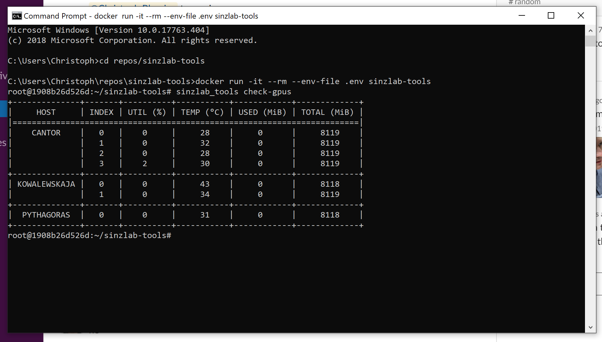

# sinzlab-tools



## Setup

1. Clone this repository:

    ``git clone https://github.com/cblessing24/sinzlab-tools.git``
    
2. Change your current working directory:

    ``cd ./sinzlab-tools``
    
3. Specify hosts and your username in `config.ini`  
(   see `example-config.ini`)

4. Specify the path to your private SSH key in `docker-compose.yml`  
    (see `example-docker-compose.yml`)

5. Build the docker image:

    ``docker build -t sinzlab-tools .``

## Usage

You can access the cli with the following command:

```docker-compose run --rm sinzlab-tools```