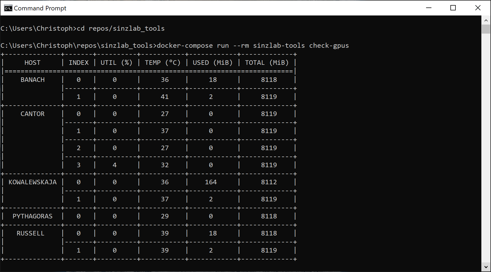

# sinzlab-tools

## Setup

1. Clone this repository:

    ``git clone https://github.com/cblessing24/sinzlab-tools.git``
    
2. Change your current working directory:

    ``cd ./sinzlab-tools``

3. Build the docker image:

    ``docker build -t sinzlab-tools .``
    
4. Create a `.env` file and add the following lines to it:

    ``USER=myusername``  
    ``PASS=mypassword``

## Usage

1. Run the image in interactive mode:

    ``docker run -it --rm --env-file .env sinzlab-tools``

2. Run the following command inside the container to access the cli:

    ``sinzlab_tools``